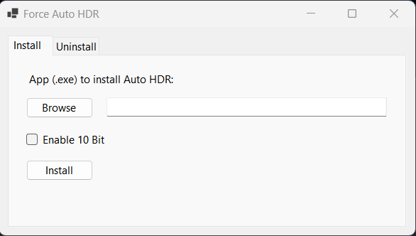

<h3>Download Link:</h3>
https://github.com/tobeadev/Force_Auto_HDR_GUI/releases/download/autohdr/ForceAutoHDR.zip

<h3>Usage:</h3>
Download ForceAutoHDR.zip and extract it. Run ForceAutoHDR.exe

<h3>Install:</h3>
On Install tab, press the Browse button and Find the .exe you want to install Auto HDR.
Tick "Enable 10 Bit" if you want it to run in 10 Bit mode.
Press the Install button. That's it.

<h3>Uninstall:</h3>
On Uninstall tab, press the Browse button and Find the .exe you want to uninstall Auto HDR.
Press the Uninstall button.
